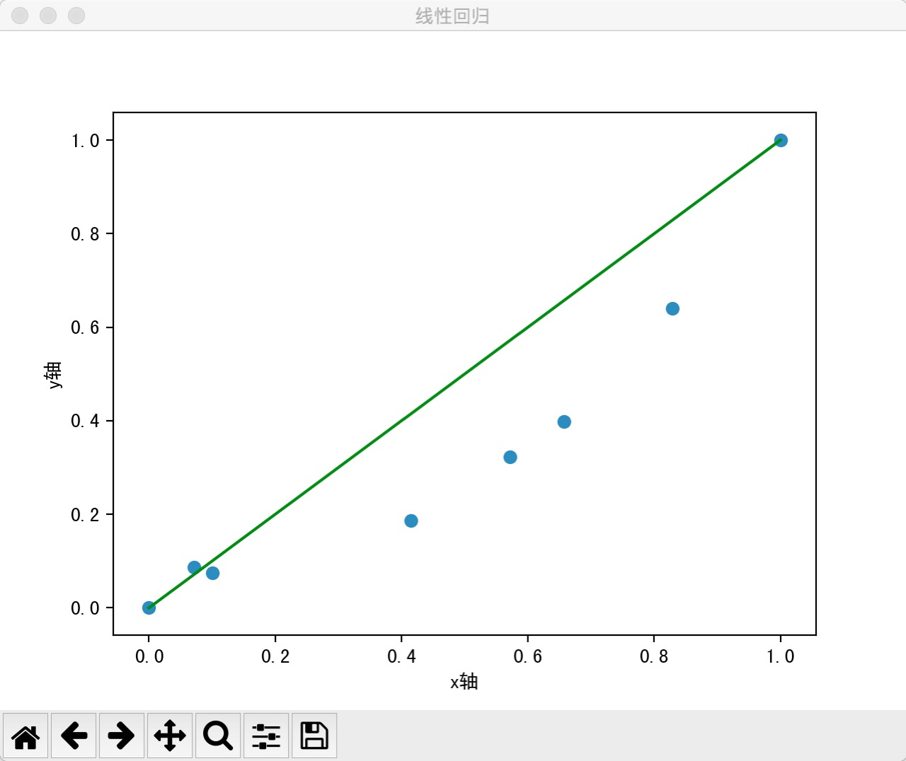
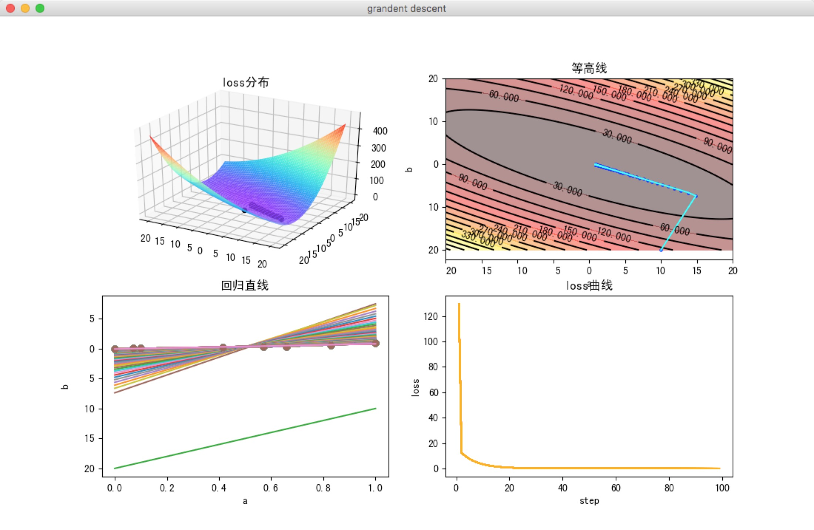
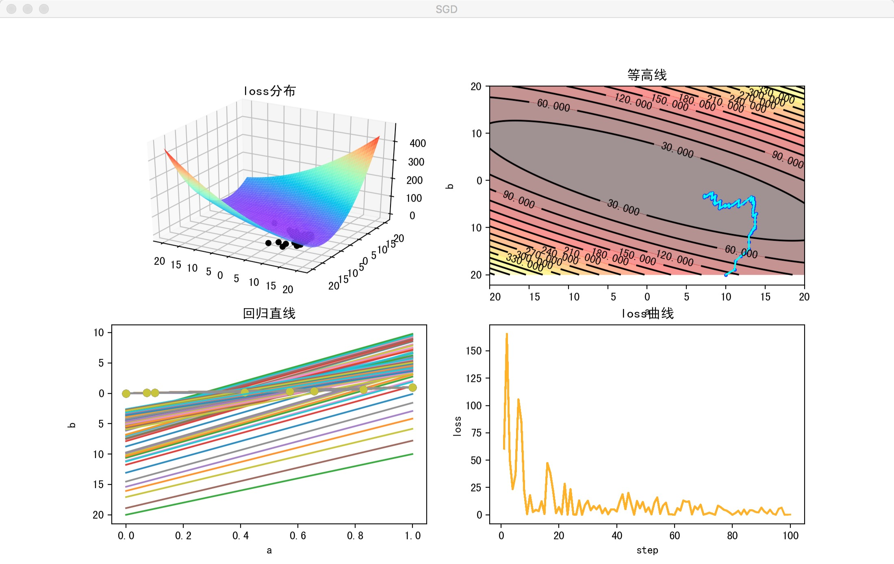
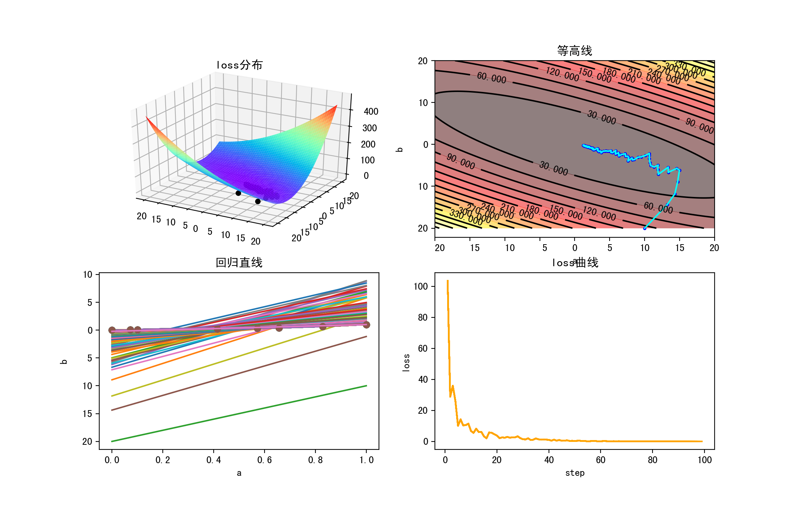

# 机器学习优化函数

> 注：如需正常显示公式，请在chrome浏览器中安装 [Github with MathJax](https://chrome.google.com/webstore/detail/github-with-mathjax/ioemnmodlmafdkllaclgeombjnmnbima) 插件

[TOC]

## 1、线性回归

### 公式

线性模型：

$$y_{p,i}=ax_i+b$$

Loss方法：Mean Squared Error (MSE), 即均方差

$$loss=\frac{1}{2m}\sum_{i=1}^m(y_{p,i}-y_i)^2$$

### 实验

```
▶ python 1_linear_regression.py
loss = 0.013575
```
结果图：


## 2、梯度下降

梯度下降，又称批量梯度下降，基本步骤是:

- 对成本函数进行微分, 得到其在给定点的梯度. 梯度的正负指示了成本函数值的上升或下降:
- 选择使成本函数值减小的方向, 即梯度负方向, 乘以以学习率 计算得参数的更新量, 并更新参数:
- 重复以上步骤, 直到取得最小的成本

在每次更新时用所有样本，其计算得到的是一个标准梯度，对于最优化问题、凸问题，也肯定可以达到一个全局最优。因而理论上来说一次更新的幅度是比较大的。如果样本不多，收敛速度较快。

### 公式

每一次迭代按照一定的学习率 α 沿梯度的反方向更新参数，直至收敛。
$$y_{p,i}=ax_i+b$$
$${loss=\frac{1}{2m}\sum_{i=1}^m(y_{p,i}-y_i)^2 }$$

合并方程
$${loss=\frac{1}{m}\sum_{i=1}^m\frac12(ax_i+b-y_i)^2 }$$

一共有m个累加项，单独提取一项：
$${loss_{i}=\frac{1}{2}(ax_i+b-y_i)^2 }$$

分别对要优化的参数 a, b 求导:
$$\frac{\partial loss_{i}}{\partial a}=(ax_i+b-y_i)x_i$$
$$\frac{\partial loss_{i}}{\partial b}=(ax_i+b-y_i)$$

再累加起来：
$$\frac{\partial loss}{\partial a}=\frac{1}{m}\sum_{i=1}^m\frac{\partial loss_{i}}{\partial a}$$
$$\frac{\partial loss}{\partial b}=\frac{1}{m}\sum_{i=1}^m\frac{\partial loss_{i}}{\partial b}$$

上述结果分别表示为▽a和▽b，更新参数：

$$a_{new}=a-\alpha \nabla a$$
$$b_{new}=b-\alpha \nabla b$$

### 实验

```
▶ python 2_grandent_descent.py
('step: ', 1, ' loss: ', 129.67006756542807)
('step: ', 2, ' loss: ', 12.373533308688465)
('step: ', 3, ' loss: ', 10.469877474959096)
('step: ', 4, ' loss: ', 8.8801567453812922)
...
('step: ', 98, ' loss: ', 0.0055166947123678148)
('step: ', 99, ' loss: ', 0.0055164418039771283)
```

结果图片：


缺点：每进行一次迭代都需要计算所有样本，当样本量比较大的时候，会非常消耗计算资源，收敛速度会很慢。

## 3、随机梯度下降（SGD）

在每次更新时用随机的一个样本（而不是全部样本）来近似所有的样本，来调整参数。

因为计算得到的并不是准确的一个梯度，因而随机梯度下降会带来一定的问题，对于最优化问题，凸问题，虽然不是每次迭代得到的损失函数都向着全局最优方向， 但是大的整体的方向是向全局最优解的，最终的结果往往是在全局最优解附近。

但是相比于批量梯度，这样的方法更快，更快收敛，虽然不是全局最优，但很多时候是我们可以接受的，所以这个方法用的也比上面的多。

### 公式

经典的梯度下降方法中，对每个样本都要计算loss：

$${loss=\frac{1}{2m}\sum_{i=1}^m(y_{p,i}-y_i)^2 }$$

SGD计算loss如下：

$${loss=\frac{1}{2}(y_{p,i}-y_i)^2 }$$

分别对要优化的参数 a, b 求导:

$$\frac{\partial loss}{\partial a}=(ax_i+b-y_i)x_i$$
$$\frac{\partial loss}{\partial b}=(ax_i+b-y_i)$$

更新参数方法同上。

### 实验

```
▶ python 3_sgd.py
('step: ', 1, ' loss: ', 60.5)
('step: ', 2, ' loss: ', 165.50225882444056)
('step: ', 3, ' loss: ', 50.994196252422434)
('step: ', 4, ' loss: ', 23.506510474101752)
('step: ', 5, ' loss: ', 36.860760029302455)
('step: ', 6, ' loss: ', 105.50932846718102)
('step: ', 7, ' loss: ', 85.462556058416624)
...
('step: ', 99, ' loss: ', 0.07423432163759032)
('step: ', 100, ' loss: ', 0.22626846673043308)
```

结果图片：



评价：整体上收敛，由于加入了随机的成分，局部有一些震荡，但对局部极小点可以跳出，得到全局最优解。

## 4、小批量随机梯度下降（minibath SGD）

其实就是一种折中的方法，在每次更新时用b个样本，其实批量的梯度下降，他用了一些小样本来近似全部的，其本质就是我1个指不定不太准，那我用个30个50个样本那比随机的要准不少了吧，而且批量的话还是非常可以反映样本的一个分布情况的。在深度学习中，这种方法用的是最多的，因为这个方法收敛也不会很慢，收敛的局部最优也是更多的可以接受！

### 公式

mini-batch 梯度下降法loss算法, k表示每一个batch的总样本数：

$${loss_{batch}=\frac{1}{2k}\sum_{i=1}^k(y_{p,i}-y_i)^2 }$$

分别对要优化的参数 a, b 求偏微分，再求和的均值:

$$\frac{\partial loss_{batch}}{\partial a}=\frac{1}{k}\sum_{i=1}^k(ax_i+b-y_i)x_i$$
$$\frac{\partial loss_{batch}}{\partial b}=\frac{1}{k}\sum_{i=1}^k(ax_i+b-y_i)$$

更新参数方法同梯度下降法。

### 实验

```
▶ python 4_minibatch_SGD.py
('step: ', 1, ' loss: ', 103.57946285839857)
('step: ', 2, ' loss: ', 28.80041267463471)
('step: ', 3, ' loss: ', 35.908370809191418)
('step: ', 4, ' loss: ', 26.135149111929373)
('step: ', 5, ' loss: ', 10.112169450578516)
('step: ', 6, ' loss: ', 14.206108139776232)
...
('step: ', 97, ' loss: ', 0.015638876450992864)
('step: ', 98, ' loss: ', 0.011350089433404403)
('step: ', 99, ' loss: ', 0.01667711949135478)
```

结果图片：



可以看出，相比SGD，波动减小的比较明显，同时收敛速度大大加快。

> 注：由于mini-batch SGD 比 SGD 效果好很多，所以**一般说SGD都指的是 mini-batch gradient descent.** 不要和原始的SGD混淆。现在基本所有的大规模深度学习训练都是分为小batch进行训练的。


momentum.py：动量

momentum_SGD.py：动量 SGD

Nesterov_momentum.py

adagrad.py: adagrad

adadelta.py: adadelta

adam.py: adam


#### 来源

代码来源于以下博客系列文章，稍作改动和重构

http://blog.csdn.net/column/details/19920.html

#### 参考

p1 参考 https://zhuanlan.zhihu.com/p/27297638

p2~pn 参考 http://ruder.io/optimizing-gradient-descent/index.html

###### 单独参考

p5 参考 http://cs231n.github.io/neural-networks-3/

p6 参考 https://zhuanlan.zhihu.com/p/22252270

p7 参考 https://arxiv.org/abs/1212.5701 (原始论文)

p8 参考 http://www.ijiandao.com/2b/baijia/63540.html
