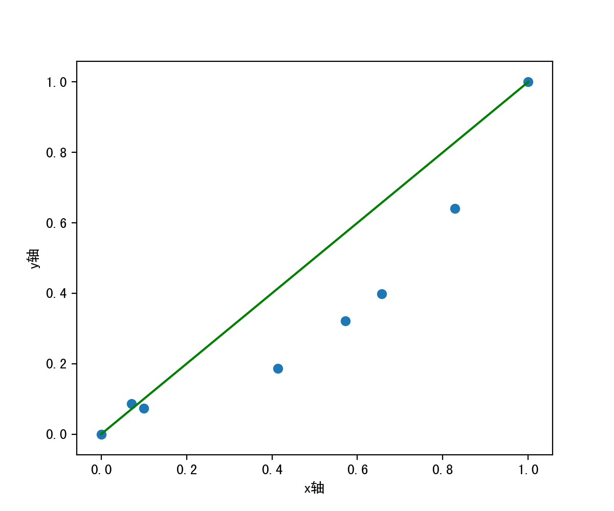
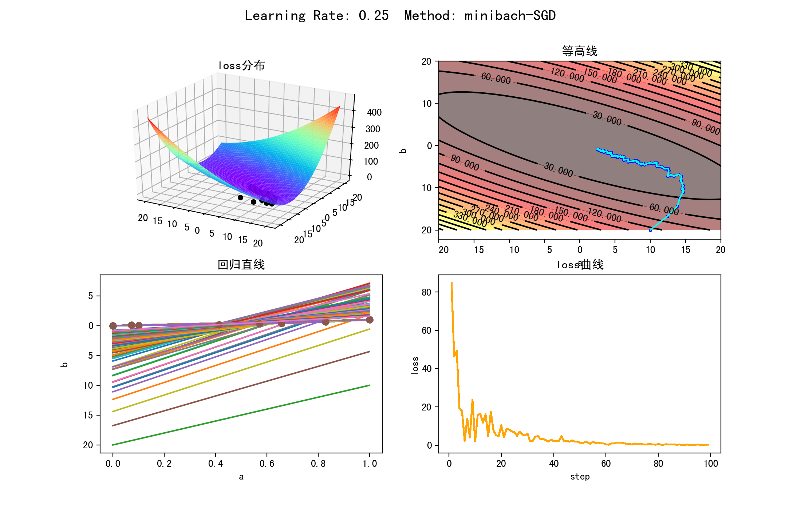
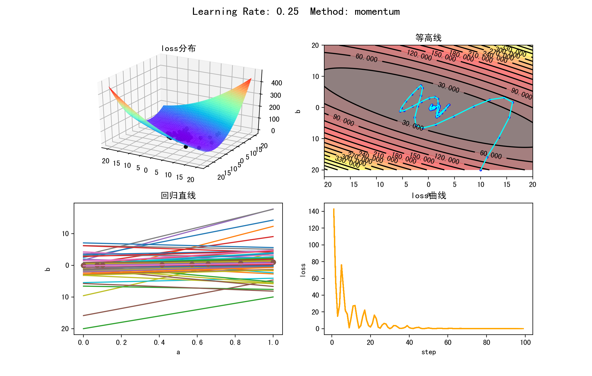
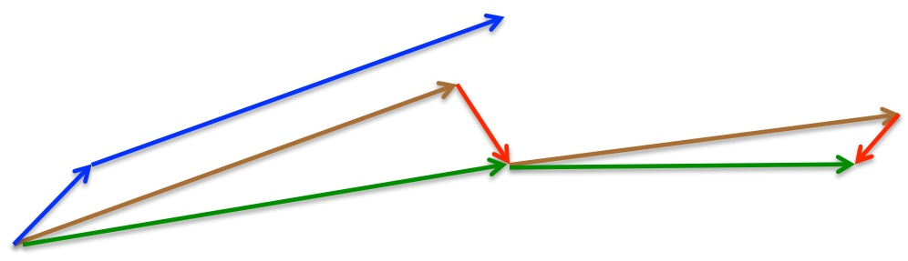
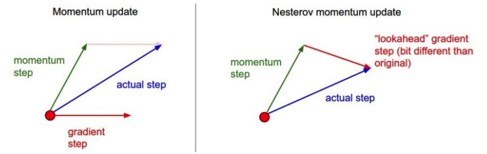
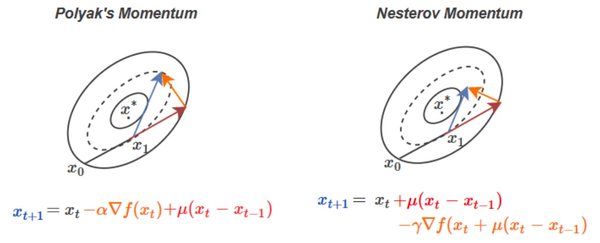
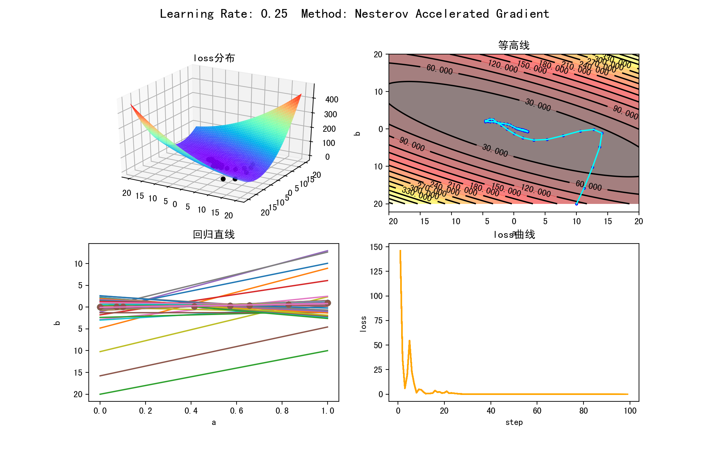
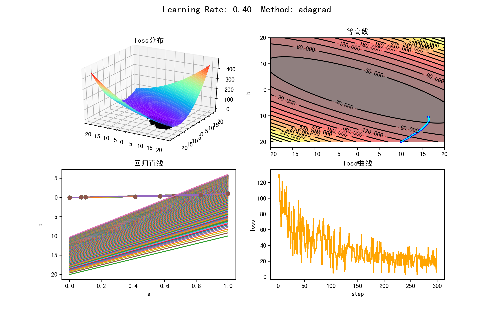

# 机器学习优化函数
> 注：如需正常显示公式，请在chrome浏览器中安装 [Github with MathJax](https://chrome.google.com/webstore/detail/github-with-mathjax/ioemnmodlmafdkllaclgeombjnmnbima) 插件

* [1、线性回归](#1线性回归)
* [2、梯度下降](#2梯度下降)
* [3、随机梯度下降（SGD）](#3随机梯度下降sgd)
* [4、小批量随机梯度下降（minibath SGD）](#4小批量随机梯度下降minibath-sgd)
* [5、动量法（momentum）](#5动量法momentum)
* [6、Nesterov accelerated gradient (NAG)](#6nesterov-accelerated-gradient-nag)

## 1、线性回归

### 公式

线性模型：

$$y_{p,i}=ax_i+b$$

Loss方法：Mean Squared Error (MSE), 即均方差

$$loss=\frac{1}{2m}\sum_{i=1}^m(y_{p,i}-y_i)^2$$

### 实验

```
▶ python 1_linear_regression.py
loss = 0.013575
```
结果图：


## 2、梯度下降

梯度下降，又称批量梯度下降，基本步骤是:

- 对成本函数进行微分, 得到其在给定点的梯度. 梯度的正负指示了成本函数值的上升或下降:
- 选择使成本函数值减小的方向, 即梯度负方向, 乘以以学习率 计算得参数的更新量, 并更新参数:
- 重复以上步骤, 直到取得最小的成本

在每次更新时用所有样本，其计算得到的是一个标准梯度，对于最优化问题、凸问题，也肯定可以达到一个全局最优。因而理论上来说一次更新的幅度是比较大的。如果样本不多，收敛速度较快。

### 公式

每一次迭代按照一定的学习率 α 沿梯度的反方向更新参数，直至收敛。
$$y_{p,i}=ax_i+b$$
$${loss=\frac{1}{2m}\sum_{i=1}^m(y_{p,i}-y_i)^2 }$$

合并方程
$${loss=\frac{1}{m}\sum_{i=1}^m\frac12(ax_i+b-y_i)^2 }$$

一共有m个累加项，单独提取一项：
$${loss_{i}=\frac{1}{2}(ax_i+b-y_i)^2 }$$

分别对要优化的参数 a, b 求导:
$$\frac{\partial loss_{i}}{\partial a}=(ax_i+b-y_i)x_i$$
$$\frac{\partial loss_{i}}{\partial b}=(ax_i+b-y_i)$$

再累加起来：
$$\frac{\partial loss}{\partial a}=\frac{1}{m}\sum_{i=1}^m\frac{\partial loss_{i}}{\partial a}$$
$$\frac{\partial loss}{\partial b}=\frac{1}{m}\sum_{i=1}^m\frac{\partial loss_{i}}{\partial b}$$

上述结果分别表示为▽a和▽b，更新参数：

$$a_{new}=a-\alpha \nabla a$$
$$b_{new}=b-\alpha \nabla b$$

### 实验

```
▶ python 2_grandent_descent.py
('step: ', 1, ' loss: ', 129.67006756542807)
('step: ', 2, ' loss: ', 69.044827279798554)
('step: ', 3, ' loss: ', 39.638649527677572)
('step: ', 4, ' loss: ', 25.219075088346727)
('step: ', 5, ' loss: ', 18.001472787310952)
...
('step: ', 97, ' loss: ', 0.12468086790027612)
('step: ', 98, ' loss: ', 0.11886345232802056)
('step: ', 99, ' loss: ', 0.11333003026025744)
```

结果图片：


缺点：每进行一次迭代都需要计算所有样本，当样本量比较大的时候，会非常消耗计算资源，收敛速度会很慢。

## 3、随机梯度下降（SGD）

在每次更新时用随机的一个样本（而不是全部样本）来近似所有的样本，来调整参数。

因为计算得到的并不是准确的一个梯度，因而随机梯度下降会带来一定的问题，对于最优化问题，凸问题，虽然不是每次迭代得到的损失函数都向着全局最优方向， 但是大的整体的方向是向全局最优解的，最终的结果往往是在全局最优解附近。

但是相比于批量梯度，这样的方法更快，更快收敛，虽然不是全局最优，但很多时候是我们可以接受的，所以这个方法用的也比上面的多。

### 公式

经典的梯度下降方法中，对每个样本都要计算loss：

$${loss=\frac{1}{2m}\sum_{i=1}^m(y_{p,i}-y_i)^2 }$$

SGD计算loss如下：

$${loss=\frac{1}{2}(y_{p,i}-y_i)^2 }$$

分别对要优化的参数 a, b 求导:

$$\frac{\partial loss}{\partial a}=(ax_i+b-y_i)x_i$$
$$\frac{\partial loss}{\partial b}=(ax_i+b-y_i)$$

更新参数方法同上。

### 实验

```
▶ python 3_sgd.py
('step: ', 1, ' loss: ', 60.5)
('step: ', 2, ' loss: ', 148.78125)
('step: ', 3, ' loss: ', 30.752974944518261)
('step: ', 4, ' loss: ', 60.245692294926464)
('step: ', 5, ' loss: ', 24.154724333378837)
...
('step: ', 98, ' loss: ', 0.096628400058548211)
('step: ', 99, ' loss: ', 0.055388452188521113)
('step: ', 100, ' loss: ', 0.73856143994818635)
```

结果图片：


评价：整体上收敛，由于加入了随机的成分，局部有一些震荡，但对局部极小点可以跳出，得到全局最优解。

## 4、小批量随机梯度下降（minibath SGD）

其实就是一种折中的方法，在每次更新时用b个样本，其实批量的梯度下降，他用了一些小样本来近似全部的，其本质就是我1个指不定不太准，那我用个30个50个样本那比随机的要准不少了吧，而且批量的话还是非常可以反映样本的一个分布情况的。在深度学习中，这种方法用的是最多的，因为这个方法收敛也不会很慢，收敛的局部最优也是更多的可以接受！

### 公式

mini-batch 梯度下降法loss算法, k表示每一个batch的总样本数：

$${loss_{batch}=\frac{1}{2k}\sum_{i=1}^k(y_{p,i}-y_i)^2 }$$

分别对要优化的参数 a, b 求偏微分，再求和的均值:

$$\frac{\partial loss_{batch}}{\partial a}=\frac{1}{k}\sum_{i=1}^k(ax_i+b-y_i)x_i$$
$$\frac{\partial loss_{batch}}{\partial b}=\frac{1}{k}\sum_{i=1}^k(ax_i+b-y_i)$$

更新参数方法同梯度下降法。

### 实验

```
▶ python 4_minibatch_SGD.py
('step: ', 1, ' loss: ', 84.775082655486585)
('step: ', 2, ' loss: ', 46.355100998210879)
('step: ', 3, ' loss: ', 49.219614648252289)
('step: ', 4, ' loss: ', 19.426229561741049)
('step: ', 5, ' loss: ', 17.776692555046939)
...
('step: ', 97, ' loss: ', 0.18700274674544323)
('step: ', 98, ' loss: ', 0.15347107047759942)
('step: ', 99, ' loss: ', 0.18048695668068537)
```

实验结果：



可以看出，相比SGD，波动减小的比较明显，同时收敛速度大大加快。

> 注：由于mini-batch SGD 比 SGD 效果好很多，所以**一般说SGD都指的是 mini-batch gradient descent.** 不要和原始的SGD混淆。现在基本所有的大规模深度学习训练都是分为小batch进行训练的。

## 5、动量法（momentum）

SGD 在遇到沟壑时容易陷入震荡。为此，可以为其引入动量 Momentum，加速 SGD 在正确方向的下降并抑制震荡。

参数更新方向不仅由当前的梯度决定，也与此前累积的下降方向有关。这使得参数中那些梯度方向变化不大的维度可以加速更新，并减少梯度方向变化较大的维度上的更新幅度。由此产生了加速收敛和减小震荡的效果。

### 公式

参数更新公式：

$$v_t = \gamma v_{t-1} + \eta \nabla_\theta J( \theta) \\$$ 
$$\theta = \theta - v_t$$

> Note: Some implementations exchange the signs in the equations. The momentum term γ is usually set to 0.9 or a similar value.

很多实现只是等式符号不同，我这里用的是上减下加。如下伪代码：

```
# Momentum update
v = mu * v - learning_rate * dx # integrate velocity
x += v # integrate position
```

### 实验

```
▶ python 5_momentum.py
('step: ', 1, ' loss: ', 142.78026539628002)
('step: ', 2, ' loss: ', 57.026908010941987)
('step: ', 3, ' loss: ', 14.878695379467619)
('step: ', 4, ' loss: ', 27.956646187512142)
('step: ', 5, ' loss: ', 76.121314278701405)
...
('step: ', 97, ' loss: ', 0.0050963082785009679)
('step: ', 98, ' loss: ', 0.0025215223884579186)
('step: ', 99, ' loss: ', 0.0260781190424971)
```

 结果图片：



> 1、从等高线图就可以看出，momentum方法每一步走的都要更远一些。由于累加了动量，会带着之前的速度向前方冲去。比如一开始loss冲入了山谷，由于有之前的动量，继续朝着对面的山坡冲了上去。随着动量的更新，慢慢地最终收敛到最小值。
>
> 2、本实验看起来好像SGD比momentum更好，这是由于数据集简单等的原因

## 6、Nesterov accelerated gradient (NAG)

该方法与动量类似，也是考虑最近的梯度情况，但是NAG相对超前一点，使用动量计算参数下一个位置的近似值，然后在这近似值位置上计算梯度。



在momentum里，先计算当前的梯度（短蓝色线），然后结合以前的梯度执行更新（长蓝色线）。而在nesterov momentum里，先根据事先计算好的梯度更新（棕色），然后在预计的点处计算梯度（红色），结合两者形成真正的更新方向（绿色）。 

再来两张图比较momentum和NAG的区别：





图参考：[Nesterov’s Accelerated Gradient, Stochastic Gradient Descent](http://mitliagkas.github.io/ift6085/ift-6085-lecture-6-notes.pdf)

### 公式

参数更新公式

$$v_t = \gamma v_{t-1} + \eta \nabla_\theta J( \theta - \gamma v_{t-1} ) \\  $$
$$\theta = \theta - v_t$$

代码中我用的仍然是上减下加。伪代码如下：

```
x_ahead = x + mu * v
# evaluate dx_ahead (the gradient at x_ahead instead of at x)
v = mu * v - learning_rate * dx_ahead
x += v
```

### 实验

```
▶ python 6_NAG.py
('step: ', 1, ' loss: ', 146.04743572162121)
('step: ', 2, ' loss: ', 35.977107943103498)
('step: ', 3, ' loss: ', 6.0189021621300283)
('step: ', 4, ' loss: ', 19.533286578486837)
('step: ', 5, ' loss: ', 54.562743141431682)
...
('step: ', 97, ' loss: ', 0.0048164795494216803)
('step: ', 98, ' loss: ', 0.0030005463443346873)
('step: ', 99, ' loss: ', 0.0086091962512396744)
```

结果图片：



评价：相比较动量法，NAG方法收敛速度明显加快，波动也小了很多。因为NAG考虑了目标函数的二阶导数信息，而梯度下降是一阶收敛。二阶其实相当于考虑了梯度的梯度，所以相对更快。它比梯度下降法更具有全局判断能力，在二阶导数的作用下，从函数的凹凸性出发，直接搜索怎样到达极值点；而梯度法是从初始点的领域开始判断，在局部进行最速下降方向，然后步步逼近极值。所以梯度下降法需要迭代的次数更多。

具体可参看：[比Momentum更快：揭开Nesterov Accelerated Gradient的真面目](https://zhuanlan.zhihu.com/p/22810533)

## 7、adagrad

前面一系列【2~6】的优化算法有一个共同的特点，就是对于每一个参数都用相同的学习率进行更新。但是在实际应用中各个参数的重要性肯定是不一样的，所以对于不同的参数要动态的采取不同的学习率，让目标函数更快的收敛。

adagrad方法就是将每一个参数的每一次迭代的梯度取平方累加再开方，用基础学习率除以这个数，来做学习率的动态更新。

优点：主要优点之一就是无需手动调整学习率。大多数的实现使用默认的0.01作为学习率，而且保持不变。

缺点：缺点就是分母中平方梯度的累积。由于每个增加项都是正数，所以在训练过程中累积和不断增加。这反过来导致学习速率缩小并最终变得极小，此时算法不再能够学习到额外的知识。

### 公式

对于经典的SGD优化函数：

$$\theta_{i\_new}=\theta_i - \eta\nabla_{\theta_i} J(\theta)$$

其中 $$\nabla_{\theta_i} J(\theta)$$ 表示第 i 个参数的梯度

adagrad的优化函数：

$$\theta_{i,t+1}=\theta_{i,t}- \frac{\eta}{\sqrt{G_{i,t}+\epsilon}}\nabla_{\theta_{i,t}} J(\theta)$$

其中t表示每一次迭代，$$\epsilon$$ 为一个极小值，防止分母为0。

$$G_{i,t}$$ 表示前 t 步参数 $$\theta_i$$ 梯度的累加:

$$G_{i,t} = G_{i,t-1}+ \nabla_{\theta_{i,t}} J(\theta)$$

从公式可以看出，随着算法不断的迭代，$$G_{i,t}$$ 会越来越大，整体的学习率会越来越小。所以一般来说adagrad算法一开始是激励收敛，到了后面就慢慢变成惩罚收敛，速度越来越慢。

伪代码：

```
# Assume the gradient dx and parameter vector x
cache += dx**2
x += - learning_rate * dx / (np.sqrt(cache) + eps)
```

### 实验

```
▶ python 7_adagrad.py
('step: ', 1, ' loss: ', 126.59260375598554, 'rate_new a:', 0.065759594913256489, ' b:', 0.025928148941541867)
('step: ', 2, ' loss: ', 130.28408907994719, 'rate_new a:', 0.05163977794512891, ' b:', 0.01820063020754319)
('step: ', 3, ' loss: ', 128.52614309900483, 'rate_new a:', 0.043905703993231217, ' b:', 0.014784425418990471)
('step: ', 4, ' loss: ', 92.199042764388466, 'rate_new a:', 0.035494260375247139, ' b:', 0.01328910988362857)
('step: ', 5, ' loss: ', 93.989115250161589, 'rate_new a:', 0.031524416248585006, ' b:', 0.012182898077406948)
...
('step: ', 297, ' loss: ', 23.068854311024474, 'rate_new a:', 0.011821082491259216, ' b:', 0.0032171350536291015)
('step: ', 298, ' loss: ', 5.8469320056443781, 'rate_new a:', 0.011815923825296271, ' b:', 0.0032171350536291015)
('step: ', 299, ' loss: ', 36.444065472904867, 'rate_new a:', 0.011815923825296271, ' b:', 0.003213706766330305)
```

结果图片：



> 可以看出收敛速度的确是特别慢，学习率低到可怜，原因参见上面说的缺点。


adadelta.py: adadelta

adam.py: adam


**参考资料：**

http://ruder.io/optimizing-gradient-descent/index.html

http://cs231n.github.io/neural-networks-3/

https://zhuanlan.zhihu.com/p/22252270

http://www.ijiandao.com/2b/baijia/63540.html
